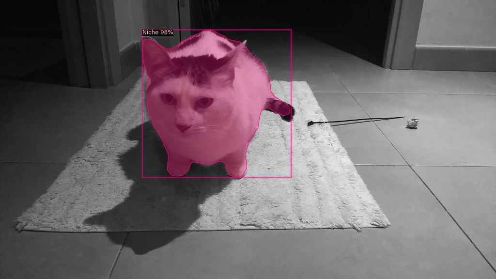
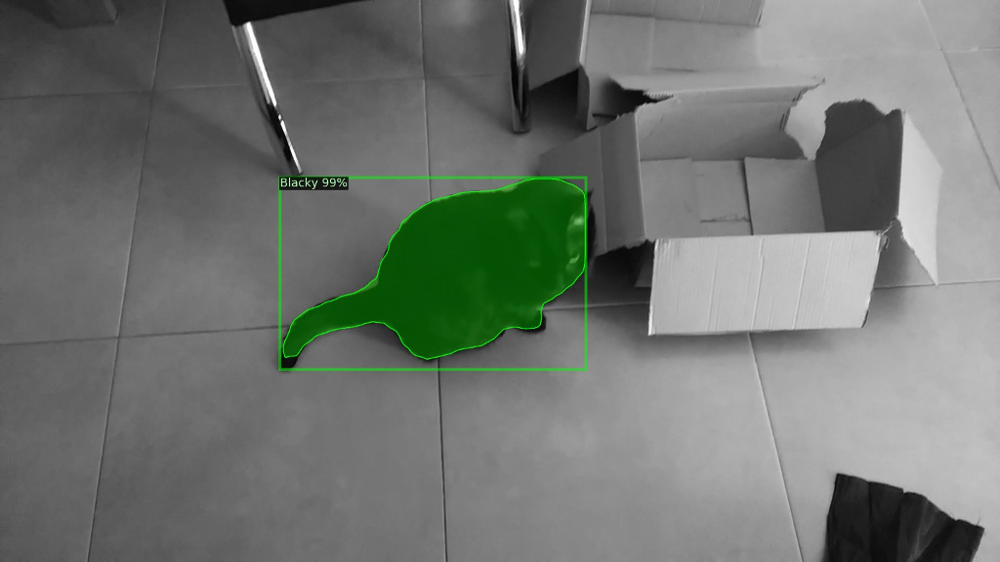
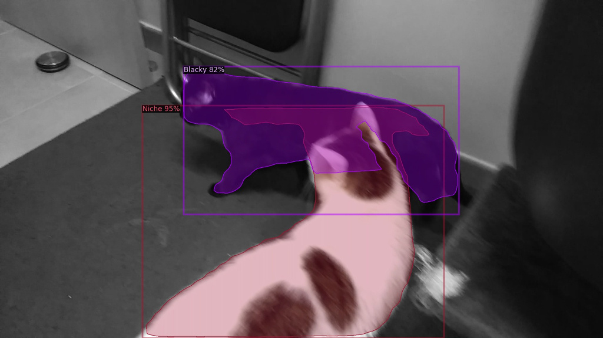

# Instance segmentation with Detectron 2

Post: [Detecting my cats with Detectron2](https://davamix.net/posts/detecting-my-cats-with-Detectron2.html) 

## Dataset

[README](./data/README.md) on <em>data</em> folder.

## Test

The [test.py](./src/test.py) file contains a function to predict one single image and another function to apply the prediction over a video.

Download the video from this [link](https://drive.google.com/open?id=1ZjnhEUtPsSep4QfqJ4fFtZPEKwblxY-W) (~16MB) and unzip it into the input folder.

## References
[Detectron 2](https://github.com/facebookresearch/detectron2)

[Ballon detection](https://github.com/davamix/balloon-detectron2)
